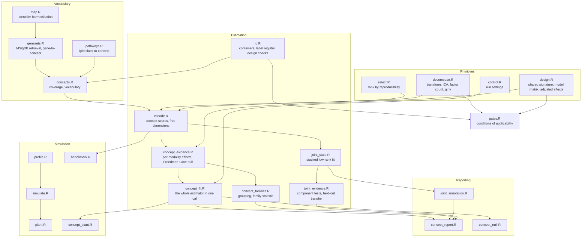

# How the source fits together

A map of the R package: which file holds what, the order units run in on each entry
point, the shape of the data at each stage, and the constraints that are load-bearing
but invisible in any one function. It is written for someone about to change the code.
`vignettes/how-it-works.Rmd` explains the method; this explains the implementation.

## Module graph

Everything in `Primitives` is unaware of what it is used for. `decompose.R` in particular
holds the only place an assay is turned into an analysis matrix
(`chorale_analysis_matrix()`), and every consumer, the estimator and the gates alike,
goes through it so that a diagnostic and the fit it describes cannot drift onto
different matrices.

## The main call path

`chorale_concept_fit()` is the entry point and fixes the order. The order is the
argument that the scores were not shaped by the contrast they are tested on, so it is
load-bearing rather than incidental.

1. `chorale_warn_shared_samples()` - the collection is checked for identifiers appearing
   in two modalities. A collision warns and does not stop the run.
2. `chorale_concepts()` - the vocabulary is fixed. Each modality's features are placed in
   it, through gene identifiers (`chorale_geneset_matrix()`) or through lipid class
   (`chorale_metabolite_matrix()`). Coverage is recorded per concept per modality and the
   `min_features` threshold is applied afterwards, so a concept below it reports its real
   feature count rather than zero.
3. `chorale_encode()` - per modality: `chorale_analysis_matrix()`, then
   `chorale_concept_scores()`, then the residual after projecting onto the span of those
   scores, then `chorale_select_factors()` and `chorale_ica()` on that residual. Nothing
   here reads the design.
4. `chorale_concept_evidence()` - the design is consulted for the first time.
   `chorale_resolve_signature()` decides what the modalities share,
   `chorale_adjusted_profile()` estimates the phenotype effect on every concept score in
   every modality, `chorale_combine_modalities()` combines them, and the permutation loop
   calibrates the whole vocabulary at once.

The joint estimator branches off after step 3 and never re-enters this path:
`chorale_joint_state()` consumes a `chorale_encode`, and `chorale_joint_evidence()` and
`chorale_joint_transfer()` consume its output. `chorale_report()` takes the fit plus any
of the optional analyses as arguments and computes none of them.

## Data flow and shapes

The one transposition worth remembering: assays are stored features-by-samples and every
analysis matrix is samples-by-features. `chorale_analysis_matrix()` is where the flip
happens.

| Stage | In | Out |
|---|---|---|
| `chorale_load()` | features x samples matrix, design data frame | `SummarizedExperiment` |
| `chorale_analysis_matrix()` | features x samples | samples x features, centred and scaled |
| `chorale_concepts()` | containers, named sets | one features x concepts membership matrix per modality |
| `chorale_concept_scores()` | samples x features, features x concepts | samples x concepts, standardised |
| `chorale_ica()` | samples x features residual | samples x k scores, features x k loadings |
| `chorale_stack_concept_scores()` | one samples x concepts matrix per modality | one (all samples) x (union of concepts) matrix, `NA` where unexpressed |
| `chorale_weighted_lowrank()` | that matrix and its observed mask | samples x k scores, concepts x k loadings |
| `chorale_adjusted_profile()` | samples x responses, design, signature | effects, standard errors, z, per term |

Nothing is persisted except by `chorale_report()`, which writes tab-separated tables, an
HTML page and `fit.rds` into a directory the caller names. `chorale_metabolite_pathways()`
reads one file shipped in `inst/extdata`; `chorale_fixture()` reads the fixtures in
`inst/fixtures`.

## External contracts

- **msigdbr** supplies the vocabulary. `chorale_geneset_registry()` records the
  collection codes per source database, which differ between the mouse-native and human
  releases. The identifier column is `ncbi_gene` in recent releases and `entrez_gene` in
  older ones; `chorale_genesets()` accepts either.
- **An `OrgDb`** supplies identifier mapping in `chorale_map()`. The organism is an
  argument, not a fixture.
- **rgoslin**, optional, parses lipid shorthand in `chorale_lipid_class()`. Absent, the
  leading token of the name is used. It reports unparsable names on the message stream,
  which is suppressed.
- **fastICA** performs the factorisation, and **clue** the one-to-one matching wherever
  components of two fits have to be paired.
- `inst/extdata/metabolite_pathways.tsv` is keyed on MSigDB Reactome set names, so it
  places a lipid in the same set whatever species the gene side was retrieved for.
  `data-raw/metabolite_pathways.R` rebuilds it.

## Invariants and ordering constraints

These are the things that break silently if reordered.

- **Encoding precedes the design.** `chorale_encode()` reads no design column. If it
  ever did, the concept scores could have been shaped by the contrast tested in step 4
  and the permutation null would no longer describe them.
- **The vocabulary is fixed before anything is tested,** and both reported error rates
  are computed over the whole of it. Filtering the vocabulary after seeing the statistics
  would describe a narrower search than the one performed.
- **Transform, then standardise, then substitute.** `chorale_analysis_matrix()` replaces
  non-finite entries only after centring and scaling, so a feature's mean and variance
  are decided by the values that were measured.
- **The encoder is never refitted under permutation.** Only the response of the
  already-computed concept scores is rebuilt, which is what makes a large permutation
  count affordable and what keeps the null attached to the scores that were tested.
- **One permutation per modality serves every concept of it.** Curated concepts overlap
  and their scores are dependent; drawing separately per concept would destroy exactly
  the dependence the family-wise maximum and the family statistic have to carry.
- **`chorale_family_evidence()` reuses `chorale_concept_evidence()`'s stored signed
  null.** A family statistic is directional, so the sign has to come from the same
  resample, not be drawn afterwards.
- **Free dimensions are orthogonal to the concept scores by construction,** because they
  are fitted on the residual after projection onto the span of those scores. A
  phenotype-linked direction sharing its direction with a concept is therefore reported
  by the concept channel and not by the free-dimension table.
- **`chorale_resolve_signature()` admits secondary covariates greedily, in the order they
  appear.** Which of two collinear covariates is dropped depends on that order, which is
  the order the design tables list their columns.
- **Row names in the stacked joint matrix are `modality:sample_id`.** Two modalities may
  reuse an identifier, and the stacking would otherwise collide them.

## Test suite

`tests/testthat/` mirrors `R/` file for file. The helpers matter more than usual:
`helper-concepts.R`, `helper-plant.R` and `helper-paired.R` build the small collections
most tests run on, and they encode the minimum shape a collection must have for the
estimator to run at all. `test-fixtures.R` checks the committed fixtures against
`data-raw/fixtures.R`, so a fixture regenerated with a different seed fails there first.
